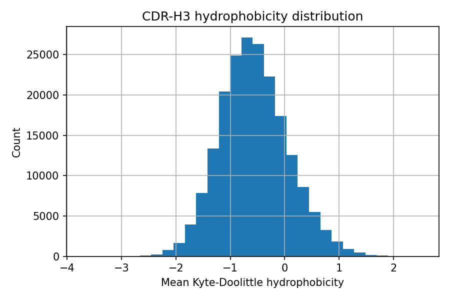
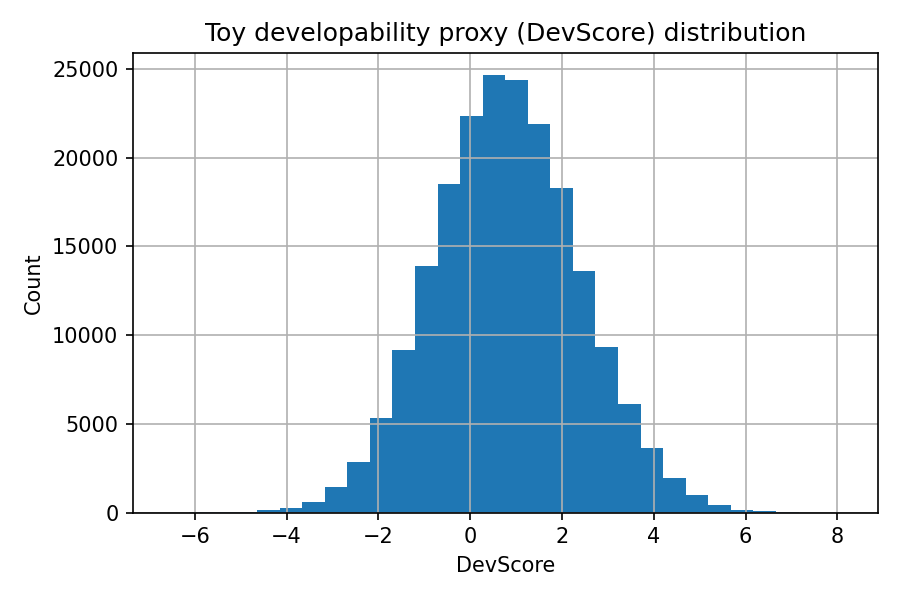
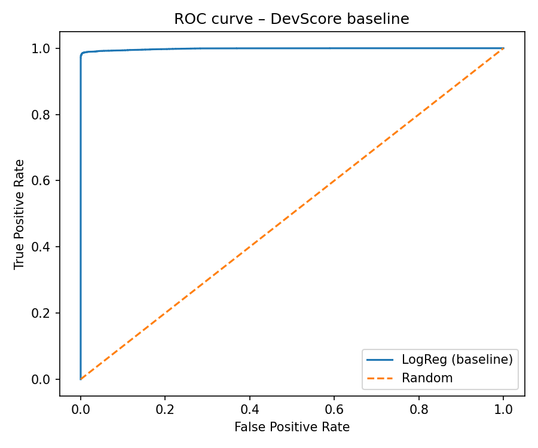

# Antibody CDR-H3 developability proxy – EDA & baseline (2025-12-02)

## 1. Dataset overview

- Total sequences used for features: **200,000**
- Sequences used after DevScore binarisation: **120,012**
- VH CDR3 length filter applied: **[5, 30] amino acids** (extreme lengths discarded)

### 1.1 CDR-H3 length statistics

```text
count    200000.000000
mean         15.667720
std           3.911186
min           5.000000
25%          13.000000
50%          15.000000
75%          18.000000
max          30.000000
Name: cdr3_len, dtype: float64
```

### 1.2 CDR-H3 hydrophobicity statistics

```text
count    200000.000000
mean         -0.561574
std           0.621884
min          -3.700000
25%          -0.990909
50%          -0.593333
75%          -0.166667
max           2.520000
Name: cdr3_hydro_mean, dtype: float64
```

### 1.3 DevScore statistics (toy developability proxy)

```text
count    200000.000000
mean          0.806049
std           1.583624
min          -6.608521
25%          -0.272510
50%           0.779373
75%           1.857419
max           8.135142
Name: devscore, dtype: float64
```

## 2. EDA figures






## 3. Baseline model: logistic regression on CDR3 features

Features used:

- `cdr3_len`
- `cdr3_hydro_mean`
- `cdr3_charge`
- `cdr3_aromatic_frac`

### 3.1 Data split and class balance

- Train size: **96,009** samples
- Test size: **24,003** samples
- Positive class proportion (train): **0.500**
- Positive class proportion (test): **0.500**

### 3.2 Performance metrics

- ROC–AUC: **0.998**
- Accuracy: **0.990**
- Precision (class 1): **0.997**
- Recall (class 1): **0.984**
- F1 (class 1): **0.990**

### 3.3 Classification report

```text
              precision    recall  f1-score   support

           0       0.98      1.00      0.99     12002
           1       1.00      0.98      0.99     12001

    accuracy                           0.99     24003
   macro avg       0.99      0.99      0.99     24003
weighted avg       0.99      0.99      0.99     24003

```

### 3.4 ROC curve



## 4. Notes

- DevScore is a **toy proxy**, combining standardized CDR3 length, hydrophobicity and absolute charge.
- Labels here do **not** correspond to experimental developability issues, only to sequence-derived risk heuristics.
